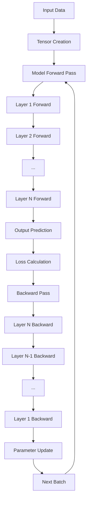
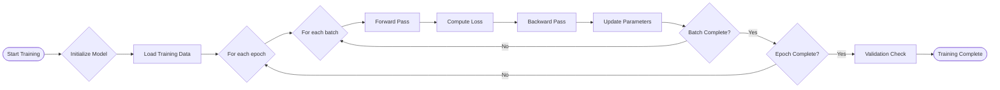

# Data Flow Diagrams and Process Charts

## High-Level Data Flow

## Forward Pass Data Flow

During the forward pass, data flows sequentially through each layer:

1. **Input Layer**: Raw data enters the network
2. **Processing**: Each layer applies its transformation
   - Dense: Matrix multiplication + bias + activation
   - Conv2D: Convolution operation + activation
   - Pooling: Down-sampling operation
   - Dropout: Random masking (training mode)
3. **Output Layer**: Final predictions are generated

## Backward Pass Data Flow

The backward pass implements backpropagation:

1. **Loss Gradient**: Computed from loss function derivative
2. **Layer-wise Backpropagation**: Gradients flow backwards through each layer
   - Each layer computes gradients w.r.t. its inputs and parameters
   - Uses chain rule to propagate gradients
3. **Parameter Updates**: Optimizer updates weights based on gradients

## Training Process Flow

## Memory Data Flow

### Tensor Memory Layout
- Data stored in contiguous `std::vector<double>`
- Row-major ordering for multi-dimensional access
- Shape information stored separately for dimension calculations

### Caching Mechanism
- Each layer caches inputs for backward pass
- Activation values cached for gradient computation
- Gradient accumulations stored for optimizer updates

## Optimizer Data Flow

### SGD with Momentum
1. Compute gradients from backward pass
2. Update velocity: `velocity = momentum * velocity + gradient`
3. Update parameters: `params = params - learning_rate * velocity`

### Adam Optimizer
1. Compute gradients from backward pass
2. Update momentum: `momentum = beta1 * momentum + (1-beta1) * gradient`
3. Update RMS: `rms = beta2 * rms + (1-beta2) * gradient^2`
4. Apply bias correction and update parameters

## Parallel Processing Flow

When enabled, matrix operations can use parallel execution:
- Large matrix multiplications are divided among threads
- Each thread processes a subset of rows
- Results are combined in the final matrix