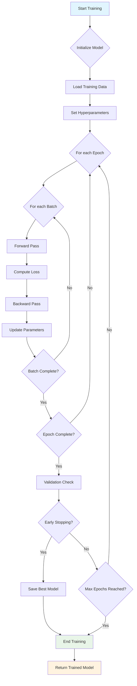
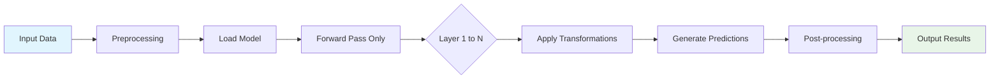
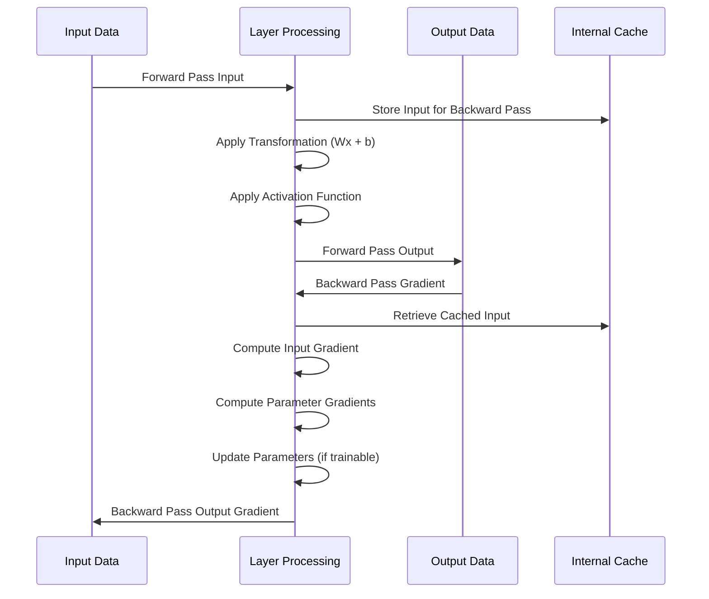
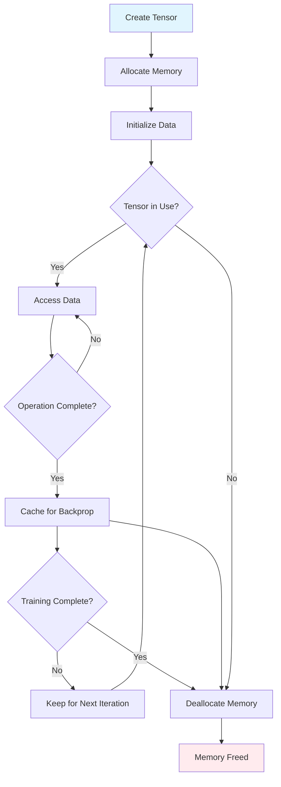
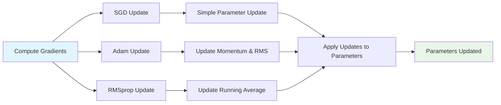
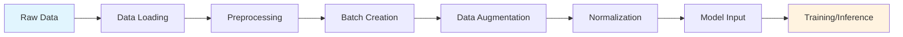

# Process Charts and Visual Diagrams

## Training Process Flow



## Inference Process Flow



## Layer Processing Workflow



## Model Architecture Visualization

```
┌─────────────────────────────────────────┐
│                    Neural Network Model                 │
├─────────────────────────────────────────────────┤
│  ┌─────────────┐  ┌─────────────┐        ┌─────────────┐ │
│  │   Dense     │  │   Dropout   │  ...   │   Dense     │ │
│  │  Layer 1    │  │  Layer 2    │        │  Layer N    │ │
│  └─────────────┘  └─────────────┘        └─────────────┘ │
│        │                   │                       │     │
│        ▼                   ▼                       ▼     │
│  ┌─────────────┐     ┌─────────────┐        ┌─────────────┐ │
│  │Weight Update│     │   Cache     │  ...   │Weight Update│ │
│  │   & Grad    │     │   Values    │        │   & Grad    │ │
│  └─────────────┘     └─────────────┘        └─────────────┘ │
└─────────────────────────────────────────┘
```

## Memory Management Flow



## Optimizer Update Process



## Data Pipeline Flow



## Component Interaction Diagram

```mermaid
graph TB
    subgraph "User Code"
        A[Model Definition]
        B[Training Loop]
    end
    
    subgraph "DNN Library"
        C[Tensor System]
        D[Layer Components]
        E[Optimizer System]
        F[Loss Functions]
    end
    
    A --> D
    B --> C
    C --> D
    D --> E
    D --> F
    E --> D
    F --> B
    
    style A fill:#e1f5fe
    style B fill:#e1f5fe